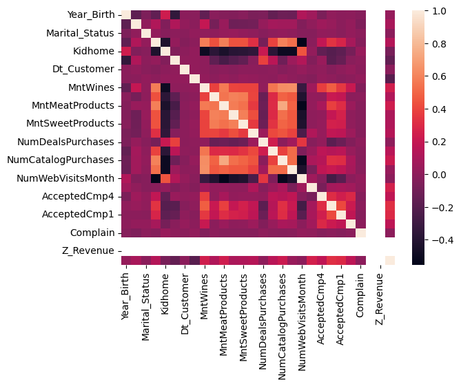
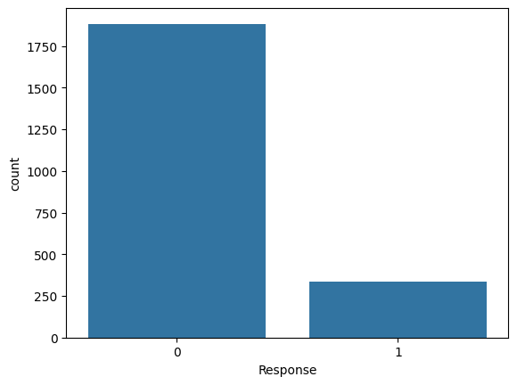
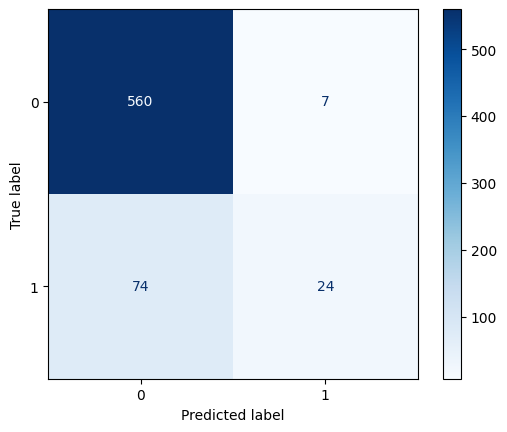
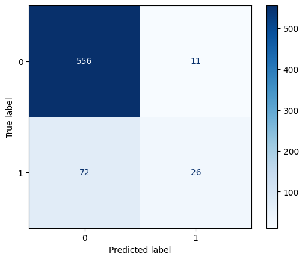
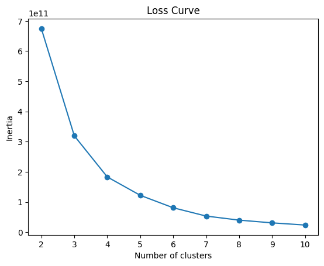
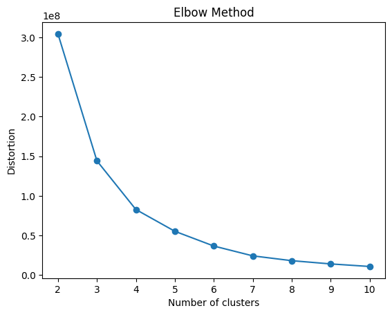
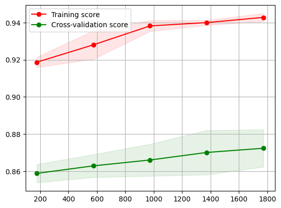
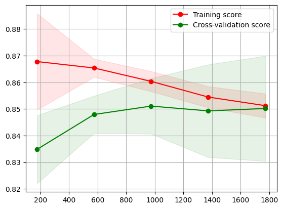
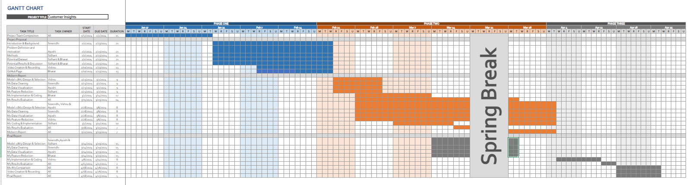

# Customer Insights
> Project Group 33: Sidhant Subramanian, Sreenidhi Reddy Bommu, Bharat Raghunathan, Ayushi Mathur, Vishnu Varma Venkata

## Midterm
### Introduction/Background

Using machine learning (ML) in marketing revolutionises personalised strategies by analysing customer traits. This project aims to harness ML to delve into these traits, enhancing targeted marketing and customer relationships. The untapped potential of ML in extracting and correlating traits from vast datasets offers promising prospects for marketing precision and efficiency.

Using machine learning (ML) in marketing has revolutionised the way businesses approach personalised strategies, fundamentally changing the landscape of customer engagement and relationship management.

By leveraging ML algorithms, marketers can now analyse complex datasets to identify intricate customer traits and preferences that are not immediately apparent., enabling a level of personalization that was previously unattainable.

This capability is particularly valuable in marketing, where understanding the nuances of customer behaviour can lead to more effective and personalised engagement strategies.

### Literature Review

Machine learning is crucial for personalized marketing, predicting customer personalities from digital footprints [1], enhancing engagement and sales with personality-tailored advertising [2], and enabling deeper personalization through advanced segmentation techniques based on personality traits [3].

### Dataset Description and Link

The Kaggle "Customer Personality Analysis" dataset is used to predict consumer behavior and improve marketing strategies, enhancing business engagement and expenditure optimization.

Dataset Link: [Customer Personality Analysis Dataset](https://www.kaggle.com/datasets/imakash3011/customer-personality-analysis/data)

### Problem and Motivation

#### Problem
Develop a machine learning model to classify customers based on their likelihood to purchase products from specific categories or channels.

This classification should consider customers' demographic details (age, education, marital status, income), household composition (number of children and teenagers), engagement history (website visits, recency of purchase), and purchasing behaviour (amount spent on various product categories, number of purchases through different channels, responses to marketing campaigns)

#### Motivation
The goal is to identify distinct customer segments that prefer different shopping venues (online, in-store, catalog) and product categories (wines, fruits, meats, fish, sweets, gold products), enabling personalized marketing strategies. This model will support targeted marketing initiatives by predicting the preferred shopping channels and product categories for new and existing customers, thereby increasing customer engagement and optimizing marketing spend.

### Methods

### Data Preprocessing

#### Feature Correlation

*Correlation Plot of all features*

#### Class Distribution

*Class Imbalance*

##### Feature encoding
First, each category in a categorical feature was convertedf into a numerical value.

##### Removing Irrelevant and Highly Correlated Features
The customer ID was dropped since it has no significance in the classification.

Among X variables, highly correlated features(>= 90% correlated with each other) were removed.

##### Removing Low-Variance Features
Constant features and low-variance features were dropped since they are not useful in our model. Ideally constant features are those with `variance = 0`. However, to remove both low variance and constant features the threshold was set to 0.01(1.00%)

##### Standardization
Individual features were standardized by removing the mean and scaling to unit variance to make them conform to a standard normal distribution.

## ML Algorithms/Models Implemented
The methodology adopted in this project involved selecting and training supervised learning algorithms to classify customers. Initially, feature selection was applied to identify relevant features and enhance model performance. Following this, supervised learning algorithms such as Random Forest and Linear SVM, were considered for model training. Hyperparameter tuning was then conducted using grid search to optimise the performance of the selected models. Additionally, unsupervised learning technique, K-means clustering, was employed for customer segmentation based on purchasing behaviour. This involved grouping customers into clusters to gain insights for targeted marketing strategies. Overall, the methodology focused on developing accurate and robust classification models to enhance customer segmentation and improve marketing strategies.

#### Supervised Learning Algorithms

#### Linear SVM
Linear SVM is a supervised learning algorithm for classification tasks. It separates the data using a single linear decision boundary, making it computationally efficient and effective for high-dimensional datasets. Linear SVM was selected for its simplicity and ability to handle linearly separable datasets. It is particularly useful when dealing with large datasets and is less prone to overfitting compared to more complex models. Additionally, SVMs can handle both linear and non-linear classification tasks through the use of kernel functions, providing flexibility in model selection. Linear SVM can separate the data by a single linear decision boundary, allowing it to effectively classify instances based on their features.

In the implemented solution, hyperparameter tuning was conducted using grid search, a technique aimed at finding the optimal combination of hyperparameters for the Support Vector Machine (SVM) classifier. The hyperparameters tuned include C, gamma, and kernel, which are critical in determining the SVM model's performance and generalisation capabilities. This process ensures that the SVM model achieves the best possible performance on the given dataset by fine-tuning the parameters to minimise errors and maximise accuracy. Additionally, the simplicity and interpretability of linear SVM make it suitable for understanding the underlying relationships between features and the target variable, providing insights into the classification process.

#### Random Forest
Random Forest is a powerful ensemble learning method that constructs multiple decision trees during training and outputs the mode of the classes (classification) or the mean prediction (regression) of the individual trees. It was chosen as a supervised learning method due to its versatility, robustness, and effectiveness in handling classification tasks. 

Random Forest is well-suited for our project's objective of classifying customers based on their likely purchase locations. It can handle both numerical and categorical features, is resistant to overfitting, and provides high accuracy even with complex datasets. Additionally, Random Forest can separate the data by non-linear decision boundaries, allowing it to capture intricate patterns in the data that may not be linear in nature.

Moreover, decision trees, the building blocks of Random Forest, inherently consider interactions between variables when making split decisions. This feature enables the algorithm to capture complex relationships and interactions within the data, making Random Forest a versatile and powerful tool for our classification task.

#### Unsupervised Learning Algorithms

#### K - Means
K-Means clustering is an unsupervised learning algorithm that partitions data points into clusters based on their similarity. It works by iteratively assigning data points to the nearest cluster centroid and updating the centroids based on the mean of the data points assigned to each cluster. One of the key reasons for selecting K-Means clustering is its ability to work well with datasets of even cluster sizes. Unlike some other clustering algorithms, K-Means does not require the number of clusters to be specified beforehand, making it flexible and adaptable to different datasets. This property allows K-Means to identify clusters of varying sizes and densities, making it suitable for a wide range of applications.

Another advantage of K-Means clustering is its simplicity and interpretability. The algorithm is easy to implement and understand, making it accessible to users with varying levels of expertise in machine learning. By clustering data based on centroids, K-Means provides a clear and intuitive representation of the underlying structure of the data, making it useful for exploratory data analysis and pattern recognition tasks.

In the implemented solution, K-Means clustering was used to group customers based on their purchasing behaviour and identify distinct segments within the dataset. By clustering customers into groups based on their similarity, businesses can gain valuable insights into customer preferences, behaviour, and purchasing patterns. This information can then be used to tailor marketing strategies, improve customer engagement, and drive business growth.

### Results and Discussion

#### Random Forest

Results:

| Class | Precision | Recall | F1-Score | Support |
|:------|:----------|:-------|:---------|:--------|
| 0     |   0.88    |  0.99  |   0.93   |   567   |
| 1     |   0.77    |  0.24  |   0.37   |   98    |

**Accuracy:** 87.82%

| Metric    | Precision | Recall | F1-Score | Support | 
|:----------|:----------|:-------|:---------|:--------|
| Macro Avg  |     0.83  |   0.62 |    0.65  |     665 |
| Weighted Avg |  0.87     |  0.88  |  0.85    |     665 |

*Confusion Matrix for Random Forest*

The confusion matrix signifies the effect of the classification model for the given dataset, and random forest perform well for this dataset. We observe that with respect to class 0 the correct predictions highly dominate and perform very well. While for class 1 the number of false predictions dominates. This shows that random forest is not performing effectively for class 1.

##### Quantitative Metrics
- Precision measures the proportion of true positive predictions among all positive predictions made by the model, it range from 0 to 1. The precision for both classes is well balanced with class 0 being 0.88 and class 1 being 0.77, this implies the local view of the predictions are quite close.
- Recall measures the proportion of true positive instances that were correctly identified by the model, it also ranges from 0 to 1. The recall for class 0 is 0.99 which is very close to 1 and captures the features for class 0 very accurately. However the recall for class 1 is 0.24 which is on the lower side. From the perspective of recall the model predicts very well for class 0 but falls behind for class 1.
- F1 score, which is the harmonic mean of precision and recall. Since we observe that the recall for class 1 is lesser compared to class 0, that impacts the F1 score which captures both precision and recall. The F1 score for class 0 is 0.93 and for class 1 it is 0.37.
 - The overall accuracy of the model is 87.82%, the reduction in the accuracy can be attributed to the lower recall for class 1.

#### SVM

Results:

| Class | Precision | Recall | F1-Score | Support |
|:------|:----------|:-------|:---------|:--------|
| 0     |   0.89    |  0.98  |   0.93   |   567   |
| 1     |   0.70    |  0.27  |   0.39   |   98    |

**Accuracy:**  87.52%

| Metric    | Precision | Recall | F1-Score | Support | 
|:----------|:----------|:-------|:---------|:--------|
| Macro Avg   |    0.79   |  0.62  |   0.66   |   665   |
| Weighted Avg|    0.86   |  0.88  |   0.85   |   665   |

*Confusion Matrix for SVM*

The confusion matrix signifies the effect of the classification model for the given dataset, and both random forest and SVM perform well for this dataset. We observe that with respect to class 0 the correct predictions highly dominate and perform very well. While for class 1 the number of false predictions dominates. This shows that the models are not performing effectively for class 1. We shall analyse the models based on quantitative metrics below.

##### Quantitative Metrics
- We can observe a similar trend for SVM when compared to random forest. 
- The precision for both classes is well balanced with class 0 being 0.89 and class 1 being 0.70, this implies the local view of the predictions are quite close.
- The recall for class 0 is 0.98 which is very good, while the recall for class 1 is 0.27 which reduces the metrics such as F1 score and accuracy. From the perspective of recall the model predicts very well for class 0 but falls behind for class 1.
- The trend for F1 score is similar with F1 score for class 0 being 0.93 and for class 1 benign 0.39. In a way when compared with random forest SVM performs slightly better in terms of recall and F1 score.
- The overall accuracy still remains at 87.52%, again the accuracy reduction is attributed to the reduced recall for class 1.

Overall when we look at random forest and SVM the final accuracy is similar but we are concerned with reducing the false negatives or customers who have responded but are classified as customers who have not and since the recall is higher for SVM instead of Random Forest we choose SVM as the better model of the two.

#### K-Means Clustering
##### Quantitative Metrics
- The silhouette coefficient for the best hyperparameters obtained by grid search is 0.67353. The range of the silhouette coefficient is from -1 to 1. The higher the silhouette coefficient, the better the clustering quality in unsupervised learning. A score close to 1 indicates the data points clustered well and are far away from neighboring clusters. The silhouette coefficient we obtained is close to 1 and signifies that this clustering model is well suited for the given dataset.

Elbow Method

*Elbow Method - Inertia*

*Elbow Method - Distortion*

In unsupervised learning, the Elbow method is used to determine the number of clusters. Inertia estimates the sum of squares within the cluster. It measures the squared distances of samples to their closest center. Lower the inertia it is better, implying the clusters are dense and separated. 

Distortion measures the average of the squared distances from cluster centers to data points. Lower distortion is better, implying compact clusters and the centroids being close. Both plots can be used to determine the number of clusters.

From the curve, we can determine the number of clusters by identifying the elbow. We can observe that after 7 clusters, the curve is linear, so the number of clusters can be taken as 7 for the K-means clustering model under consideration.

#### Supervised Model Analysis

*Learning Curve for Random Forest*

The learning curve explores the effect of the size of the training data on the training and cross-validation scores. From the learning curve for the random forest, the training score increases profoundly until 1000 samples and beyond that we can see a linear increase as well but not as steep as towards the left half of the plot. 

While the cross-validation scores show a trend of increasing testing scores almost linearly throughout as the training sample size is increased. Since both the training and cross-validation scores are increasing and are at a good range of values we don’t observe any overfitting or underfitting in the learning curve. 

Considering the right part of the plot where the dataset is large enough, we observe that the training score stands at 0.94 and cross-validation score stands at 0.87. Since both the scores are increasing with higher training sizes it captures the patterns effectively.

*Learning Curve for SVM*

For the obtained model after taking the best hyperparameters from cross validation, we have the learning curve. We see that the cross-validation scores increases throughout, even thought the training scores see a slight decrement. This indicates the improvement in generalization of the model as it is improving its ability to generalize to unseen data effectively. 

This model captures the underlying patterns of the data that are consistent across different subsets. Since both the training and cross-validation scores are relatively high and the testing scores dont see a decreasing trend we don’t see any overfitting or underfitting in the learning curve. 

Overall seeing the trend of training score and cross-validation score it suggests that the model is moving towards a better balance between capturing patterns in the data and generalizing to unseen data.

### Midterm Timeline
[Link to Gantt Chart Spreadsheet](https://gtvault-my.sharepoint.com/:x:/g/personal/braghunathan6_gatech_edu/EdOIA96B63lAuuimPIdRCZ4BP_hUtCNmEp74v8O8sn5kRA?e=7HXVFD)

### Contribution Table

| Name    | Midterm Contribution              |
|:---------|:-----------------------------------|
| Sreenidhi Reddy Bommu | Introduction/Background, Data Preprocessing, Next Steps |
| Ayushi Mathur | Methods - Supervised and Unsupervised Learning   |
| Sidhant Subramanian | Problem Definition, Modeling |
| Bharat Raghunathan | Data Preprocessing, GitHub Repository, GitHub Pages |
| Vishnu Varma Venkata | Results and Metrics Discussion  |

### Next Steps

As we continue to refine our customer insights project, the next phase will involve the implementation of additional machine learning models to further enhance our understanding and segmentation of customer data. It is helpful  for improving our marketing strategies and achieving a higher degree of personalization in our customer engagement efforts.

The models to be implemented include:

#### Supervised Learning
##### Neural Network
- We plan to develop a Neural Network model due to its ability to model complex patterns and accommodate diverse data distributions. Neural Networks are particularly effective for classifying non-linearly separable data, making them an excellent choice for our dataset, which includes a wide range of customer behaviors and traits.

- By leveraging deep learning techniques, we aim to uncover intricate relationships within our data that simpler models might miss.

#### Unsupervised Learning
##### Hierarchical Clustering
- This model will allow us to identify naturally occurring groups within our customer base without pre-specifying the number of clusters. Hierarchical Clustering is suited for our project as it provides a detailed insight into the customer data's structure, revealing how customer segments are related at different levels of granularity. 

- This will enable us to develop a detailed understanding of customer preferences and behaviours, helping in coming up with  targeted marketing strategies.

##### OPTICS
- This is another unsupervised learning model we plan to implement, it helps in handling varying cluster sizes and densities effectively. This model is particularly beneficial for our dataset, which likely contains diverse customer segments. 

- OPTICS will help us identify these segments based on density, overcoming the limitations of models that assume clusters of similar sizes. By employing OPTICS, we aim to achieve a more flexible and accurate segmentation of our customer base, improving our ability to target marketing efforts effectively.

Each of these models will be tested and evaluated to ensure they meet our project's objectives. The implementation of these models helps in achieving a better understanding of our customers, enabling the delivery of highly personalized marketing messages that resonate with each segment's unique preferences and needs.

### References
[1]: <a>https://doi.org/10.1073/pnas.1218772110</a> - `M. Kosinski, D. Stillwell, and T. Graepel, "Private traits and attributes are predictable from digital records of human behavior," Proceedings of the National Academy of Sciences, vol. 110, no. 15, pp. 5802-5805, April 2013.`

[2]: <a>https://www.pnas.org/doi/full/10.1073/pnas.1710966114</a> - `S.C. Matz, M. Kosinski, G. Nave, and D.J. Stillwell, "Psychological targeting as an effective approach to digital mass persuasion," Proceedings of the National Academy of Sciences, vol. 114, no. 48, pp. 12714-12719, November 2017.`

[3]: <a>https://doi.org/10.48550/arXiv.2306.17170</a> - `J. Zhang, Y. Wang, and P.S. Yu, "Community structure detection in social networks with node attributes," IEEE Transactions on Knowledge and Data Engineering, vol. 31, no. 10, pp. 1984-1997, Oct. 2019.`

[4]: [scikit-learn: Machine Learning in Python](https://jmlr.csail.mit.edu/papers/v12/pedregosa11a.html) - `F. Pedregosa, G. Varoquaux, A. Gramfort, V. Michel, B. Thirion, O. Grisel, M. Blondel, P. Prettenhofer, R. Weiss, V. Dubourg, J. Vanderplas, A. Passos, D. Cournapeau, M. Brucher, M. Perrot, and E. Duchesnay, "Scikit-learn: Machine Learning in Python," Journal of Machine Learning Research, vol. 12, pp. 2825-2830, 2011.`

[5]: [Array programming with NumPy](https://doi.org/10.1038/s41586-020-2649-2) - `C.R. Harris, K.J. Millman, S.J. van der Walt, R. Gommers, P. Virtanen, D. Cournapeau, E. Wieser, J. Taylor, S. Berg, N.J. Smith, R. Kern, M. Picus, S. Hoyer, M.H. van Kerkwijk, M. Brett, A. Haldane, J. Fernández del Río, M. Wiebe, P. Peterson, P. Gérard-Marchant, K. Sheppard, T. Reddy, W. Weckesser, H. Abbasi, C. Gohlke, T.E. Oliphant, "Array programming with NumPy," Nature, vol. 585, no. 7825, pp. 357-362, Sep. 2020.`

[6]: [pandas: Pandas](https://doi.org/10.5281/zenodo.3509134) - `The pandas development team, "pandas-dev/pandas: Pandas," Zenodo, version: latest, Feb. 2020.`